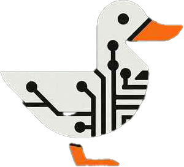

# Duckington CLI

<!-- markdownlint-disable MD033 -->
<div style="text-align: center;">
    
</div>

The CLI is built using [click](https://click.palletsprojects.com/en/8.1.x/).

Use the following command to get started with the CLI:

```bash
quack --help
```

## Contributing

To get started contributing to this project see the [setup](docs/setup.md) page

## Testing

`pytest` docs can be found [here](https://docs.pytest.org/en/stable/). See basic run instructions below, which collects all tests and runs them, with default verbosity (should work from root dir or test dir)

```bash
pytest
```

or

```bash
python3 -m pytest
```
